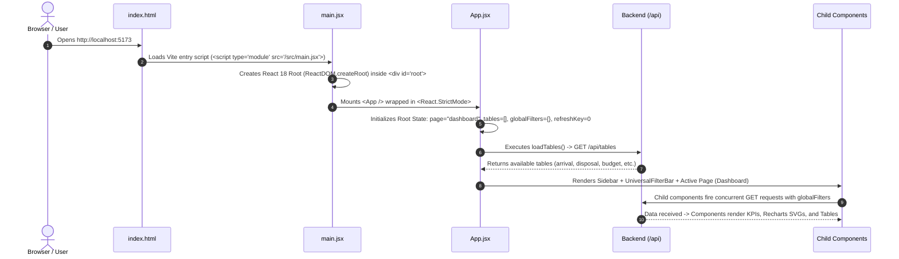

# Frontend Component Master Reference & Complete System Guide

> **Project**: Ford Vehicle Fleet & KPI Dashboard  
> **Framework**: React 18.3.1 (Concurrent Mode) + Vite 5.4.6  
> **UI Library**: Custom Vanilla CSS Design System + Recharts 2.12.7  
> **HTTP Layer**: Axios 1.7.7 with Vite Reverse Proxy

---

## 1. Application Bootstrap Flow (From Start to Finish)



---

## 2. Infrastructure & Utility Modules

---

### `index.html` — The Single Page Application Shell
* **Path**: `frontend/index.html`
* **Purpose**: The sole HTML file delivered to the browser.
* **Key Mechanics**:
  - Contains `<div id="root"></div>` where the entire React virtual DOM is mounted.
  - Pre-loads Google Fonts (`Inter` for UI typography and `IBM Plex Mono` for numbers and tabular metrics).
  - Loads the module entry point `<script type="module" src="/src/main.jsx"></script>`.

---

### `vite.config.js` — Build System & Reverse Proxy
* **Path**: `frontend/vite.config.js`
* **Purpose**: Configures Vite dev server, React Fast Refresh plugin, and local API proxying.
* **Key Code**:
  ```js
  export default defineConfig({
    plugins: [react()],
    server: {
      port: 5173,
      proxy: {
        "/api": {
          target: "http://127.0.0.1:8000",
          changeOrigin: true,
        },
      },
    },
  });
  ```
* **Why this matters**: Any HTTP request sent to `/api/...` in the frontend is automatically forwarded to FastAPI at `http://127.0.0.1:8000/api/...`. This completely eliminates CORS (Cross-Origin Resource Sharing) restrictions in development.

---

### `main.jsx` — React 18 Entry Point
* **Path**: `frontend/src/main.jsx`
* **Purpose**: Bootstraps the React component tree into the DOM root.
* **Key Code**:
  ```jsx
  import React from "react";
  import ReactDOM from "react-dom/client";
  import App from "./App.jsx";
  import "./index.css";

  ReactDOM.createRoot(document.getElementById("root")).render(
    <React.StrictMode>
      <App />
    </React.StrictMode>
  );
  ```
* **React 18 Detail**: Uses `createRoot` (the Concurrent Mode API introduced in React 18). `<React.StrictMode>` intentionally double-invokes effects in development to detect memory leaks, uncleaned subscriptions, and impure functions.

---

### `api.js` — Centralized HTTP Client
* **Path**: `frontend/src/api.js`
* **Purpose**: Houses all backend communication in a clean, reusable layer.
* **Key Functions**:
  - `buildParams({ year, month, filters })`: Formats query parameters. Stringifies nested filter objects via `JSON.stringify(filters)`.
  - `uploadFiles(files, targetTable)`: Appends files to a `FormData` object with `multipart/form-data` header.
  - `fetchTables()`: `GET /api/tables` (returns schema and row counts).
  - `fetchFilterOptions(table)`: `GET /api/filters/{table}` (returns distinct years, months, categories).
  - `fetchKpis(table, filterState)`: `GET /api/kpis/{table}`.
  - `fetchChartData(table, x, y, agg, filterState)`: `GET /api/chart-data/{table}`.
  - `fetchPeriodTrend(table, period, filterState)`: `GET /api/period-trend/{table}`.
  - `fetchTeamWiseSummary(filterState)`: `GET /api/team-wise-summary`.
  - `fetchDashboardKpis(table, filterState)`: `GET /api/dashboard-kpis/{table}`.
  - `fetchGlidepath(deptNo, year)`: `GET /api/glidepath`.
  - `saveGlidepath(payload)`: `POST /api/glidepath/save`.
  - `askFordAi(message, history, filters)`: `POST /api/ai/chat`.

---

### `colors.js` — Deterministic Data Visualization Palette
* **Path**: `frontend/src/colors.js`
* **Purpose**: Ensures color consistency across disparate charts, tables, and alert badges.
* **Exports**:
  - `METRIC_COLORS`: Static map assigning specific branding colors to entities (`arrival`: `#1f8a8a`, `disposal`: `#e0607a`, `budget`: `#3b5bdb`, etc.).
  - `TEAM_ACCENT_COLORS`: Array of 8 curated high-contrast hex codes.
  - `colorForTeam(team, teamOrder)`: Computes `TEAM_ACCENT_COLORS[teamOrder.indexOf(team) % length]`. Guarantees a team always gets the same color everywhere.

---

## 3. Comprehensive Component-by-Component Guide

---

### 1. `App.jsx` — Root Application Orchestrator
* **Path**: `frontend/src/App.jsx`
* **Role**: Top-level Container Component. Holds global session state and renders the navigation sidebar + active view.

#### State Variables:
| State | Default | Purpose |
| :--- | :--- | :--- |
| `page` | `"dashboard"` | Active tab (`"dashboard"`, `"teamwise"`, `"glidepath"`, `"upload"`, `"ai_analyst"`). |
| `tables` | `[]` | List of table metadata objects from database. |
| `globalFilters` | `{ year: "", month: "", filters: {} }` | App-wide filter criteria. |
| `refreshKey` | `0` | Cache-busting counter incremented upon file uploads. |

#### Key Handlers & Effects:
- `loadTables()`: Calls `fetchTables()` to populate `tables`.
- `handleUploaded()`: Callback given to `<FileUpload />`. Re-runs `loadTables()` and increments `refreshKey` so all active charts re-fetch data immediately.
- `useEffect(..., [page])`: Re-reads database table counts whenever the user changes navigation tabs.

---

### 2. `UniversalFilterBar.jsx` — Global Filter Controller
* **Path**: `frontend/src/components/UniversalFilterBar.jsx`
* **Role**: Multi-dataset filter bar with Draft/Apply mechanics.

#### Props:
- `value`: Current committed global filter object from `App.jsx`.
- `onChange`: Callback function `setGlobalFilters` to commit new filters.

#### State:
- `options`: Merged schema options `{ years: [], months: [], categorical_filters: [], numeric_filters: [] }`.
- `draft`: Local uncommitted copy of the filter object.

#### Key Mechanics:
1. **Concurrent Initialization**: On mount, fires `Promise.all` across 5 datasets with `.catch(() => null)` so that missing tables don't break the filter bar.
2. **Schema Unioning (`mergeFilterOptions`)**: Unions distinct years, months, and columns from all loaded tables using JavaScript `Set` objects.
3. **Dirty State Check**:
   ```jsx
   const isDirty = JSON.stringify(draft) !== JSON.stringify(value);
   ```
   The "Apply" button is disabled until the user makes a change, preventing accidental API spam.

---

### 3. `DashboardKpiRow.jsx` — Summary Metric Strip
* **Path**: `frontend/src/components/DashboardKpiRow.jsx`
* **Role**: Displays high-level summary tiles at the top of the main Dashboard.

#### Props:
- `hasArrival` (bool), `hasDisposal` (bool), `globalFilters` (obj), `refreshKey` (num).

#### State:
- `arrival` (obj): Holds `{ total, this_month, status_label, status_count }`.
- `disposal` (obj): Holds `{ total, this_month, status_label, status_count }`.

#### Key Mechanics:
- Executes dual `useEffect` hooks independently for Arrival and Disposal KPIs.
- Constructs an array of tile configurations and filters out inactive tiles via `.filter(Boolean)`.
- Renders cards with custom colored accent borders (`borderTopColor: t.accent`) and translucent icon backgrounds (`background: `${t.accent}1a``).

---

### 4. `AlertsPanel.jsx` — Operational Warnings & Glide Path Variances
* **Path**: `frontend/src/components/AlertsPanel.jsx`
* **Role**: Evaluates business logic rules across datasets and renders proactive warnings.

#### Props:
- `globalFilters` (obj), `refreshKey` (num).

#### State:
- `summary`: Cross-table metrics by team from `/api/team-wise-summary`.
- `gpComparison`: Vehicle glidepath comparison data from `/api/glidepath-summary-comparison`.

#### Business Logic Evaluated in Component:
1. **Surplus Disposal Check**: If `Niv Sheet Disposal > Actual Disposal`, flags an alert: *"Dispose Additional count"*.
2. **Budget Overrun Check**: If `Budget > Maximo Budget`, flags an alert: *"Budget Exceed"*.
3. **Glide Path Comparison Cards**:
   - **Arrival vs GlidePath**: Compares actual NIV arrivals against GlidePath planned additions.
   - **Disposal Alert**: Highlights exact number of vehicles required to dispose to maintain glide path targets.
   - **Maximo Budget Variance**: Displays vehicle variance against authorized Maximo budget.

---

### 5. `DatasetSection.jsx` — Modular Dataset Container
* **Path**: `frontend/src/components/DatasetSection.jsx`
* **Role**: Self-contained dashboard card for a single dataset (e.g., Arrivals or Disposal).

#### Props:
- `table` (string): Table identifier (`"arrival"` or `"disposal"`).
- `label` (string): Display header (`"Arrivals"` or `"Disposal"`).
- `meta` (object): Schema metadata and row count.
- `refreshKey` (number), `globalFilters` (object).

#### Composition:
Composes three modular visualization components:
1. `<TeamPieChart />` (Categorical distribution by team).
2. `<TrendChart />` (Time-series month-by-month trajectory).
3. `<ChartBuilder />` (Ad-hoc dimension explorer).

---

### 6. `ChartBuilder.jsx` — Dynamic Ad-Hoc Data Explorer
* **Path**: `frontend/src/components/ChartBuilder.jsx`
* **Role**: Interactive chart builder allowing users to group any column by any aggregate function.

#### Props:
- `table`, `columns`, `rowCount`, `filters`, `refreshKey`.

#### State:
- `x`: Group-by dimension column.
- `y`: Numerical measure column.
- `agg`: Aggregate function (`"count" | "sum" | "avg" | "min" | "max"`).
- `data`: Query result array `[{ x: "Team A", y: 45 }, ...]`.
- `error`: Network or SQL error string.

#### Smart Heuristic (`pickDefaultGroupCol`):
Filters out columns where `distinct_count >= rowCount * 0.9` (like VIN, Tag, or ID numbers) so the chart doesn't attempt to group by unique row identifiers by default.

#### Chart Rendering:
Renders a Recharts `<BarChart>` inside `<ResponsiveContainer>` with angled X-axis labels (`angle={-25}`) and formatted tooltips.

---

### 7. `TrendChart.jsx` — Time-Series Line Graph
* **Path**: `frontend/src/components/TrendChart.jsx`
* **Role**: Displays time-series volume trends over time.

#### Props:
- `trend` (object): `{ date_column, value_column, points: [{ period: "2026-01", value: 120 }, ...] }`.

#### Key Mechanics:
- If `trend` is null or dataset lacks a date column, renders a graceful `.empty-state` message.
- Renders a smoothed monotone line (`<Line type="monotone" dataKey="value" stroke="#1f8a8a" strokeWidth={2.5} dot={false} />`).

---

### 8. `TeamPieChart.jsx` — Categorical Breakdown Pie Chart
* **Path**: `frontend/src/components/TeamPieChart.jsx`
* **Role**: Visualizes distribution of vehicles across teams or categorical dimensions.

#### Props:
- `table`, `columns`, `filters`, `refreshKey`.

#### Key Mechanics:
- Automatically detects columns named `team` or defaults to the first string column.
- Computes `total = data.reduce((sum, d) => sum + d.y, 0)`.
- Renders `<Pie>` with custom slice colors cycling through the color palette.
- Custom tooltip formatter displaying both raw count and percentage: `formatter={(v) => [`${v} (${((v/total)*100).toFixed(1)}%)`, "count"]}`.

---

### 9. `TeamWisePage.jsx` — Cross-Department Overview
* **Path**: `frontend/src/components/TeamWisePage.jsx`
* **Role**: Container for the "Team Wise" navigation view.

#### Props:
- `tables` (array), `refreshKey` (number), `globalFilters` (object).

#### Layout:
1. **Top Metric Strip**: 6 KPI cards for Arrivals, Disposal, Budget, Niv Sheet Arrival, Niv Sheet Disposal, and Maximo Budget.
2. `<TeamWiseByTeam summary={summary} />`: Matrix table.
3. `<TeamWiseSection />` for Niv Sheet Arrival.
4. `<TeamWiseSection />` for Niv Sheet Disposal.

---

### 10. `TeamWiseByTeam.jsx` — Cross-Metric Comparison Matrix
* **Path**: `frontend/src/components/TeamWiseByTeam.jsx`
* **Role**: Full-width matrix table comparing all 6 categories across every team.

#### Props:
- `summary` (object): Aggregated data from `/api/team-wise-summary`.

#### Key Mechanics:
- Renders table headers dynamically from `summary.metrics`.
- Renders rows for each team with team color dots (`TEAM_ACCENT_COLORS`).
- Renders metric values inside styled badges (`.metric-badge`) with tinted background colors (`${color}1a`).

---

### 11. `TeamWiseSection.jsx` — Team Workload & Trend Component
* **Path**: `frontend/src/components/TeamWiseSection.jsx`
* **Role**: Renders side-by-side By-Team Bar Chart and Monthly/Yearly Trend Chart.

#### Props:
- `table`, `label`, `teamOrder`, `globalFilters`.

#### State:
- `teamData` (array), `period` (`"month" | "year"`), `trendPoints` (array).

#### Key Mechanics:
- Contains toggle buttons to switch trend aggregation between **Monthly** and **Yearly**.
- Bar chart colors each bar dynamically using `<Cell fill={colorForTeam(d.x, teamOrder)} />`.

---

### 12. `GlidePathPage.jsx` — Department Fleet Governance & Simulator
* **Path**: `frontend/src/components/GlidePathPage.jsx`
* **Role**: Enterprise governance matrix, 12-month vehicle additions/disposals planning, and real-time simulator.

#### State:
- `departments`, `selectedDeptNo`, `years`, `selectedYear`, `data`, `loading`, `error`.
- **Edit State**: `isEditing` (bool), `editDept` (object), `editBudget` (object), `editMonths` (array), `saving` (bool), `saveMessage` (object).

#### Computational Engine (`useMemo`):
- `liveCalculatedMonthly`: Re-computes cumulative running fleet balance (`running = running + (build + prod) - disposal`) live on every keystroke in edit mode.
- `liveTotals`: Computes table footer sums and year-end target variances.

#### Visual Composition:
1. **Header Controls**: Department selector, Year selector, Edit/Save/Cancel buttons.
2. **Governance Card**: Department No, Activity, Manager, Coordinator, Chief Engineer, Director LL2, Finance Approver, Cost Center.
3. **Budget KPI Strip**: Previous Year Authorized Budget, Starting Fleet Count, Target December Budget (-5%), and Live December Ending Count with status indicator (`✓ Target Met` vs `+X Over Target`).
4. **Trajectory Chart**: Dual-axis `ComposedChart` with running count line (left axis), additions/disposals bars (right axis), and dashed December target line.
5. **Excel Matrix Table**: 12-month editable spreadsheet matrix with calculation footnote.

---

### 13. `FileUpload.jsx` — Drag-and-Drop Ingestion Component
* **Path**: `frontend/src/components/FileUpload.jsx`
* **Role**: Self-service Excel file uploader with table override capabilities.

#### Props:
- `onUploaded` (callback): Triggers `handleUploaded` in `App.jsx`.

#### State:
- `picked` (array), `targetTable` (`"auto" | "arrival" | "disposal" | ...`), `dragging` (bool), `busy` (bool), `error`, `result`.

#### Key Mechanics:
- `useRef(null)`: References hidden native `<input type="file" />`.
- Drag-and-drop event handlers: `onDragOver`, `onDragLeave`, `onDrop` with `e.preventDefault()`.
- Filter validation: Enforces `.xlsx` and `.xls` extensions.
- Sends multipart `FormData` via `uploadFiles(picked, targetTable)`.
- Renders detailed post-upload feedback (new rows added, duplicates skipped, total row count).

---

### 14. `AskFordAiPage.jsx` — Conversational Fleet AI Analyst
* **Path**: `frontend/src/components/AskFordAiPage.jsx`
* **Role**: Executive chat interface with Google Gemini AI integration.

#### Props:
- `globalFilters` (object): Passed to backend to ground AI responses in active filter context.

#### State:
- `messages`: Array of `{ id, sender: "user"|"ai", text }`.
- `input`: Controlled text input string.
- `loading`: Boolean indicating inference in progress.

#### Key Mechanics:
- `useRef`: `messagesEndRef` triggers `scrollIntoView({ behavior: "smooth" })` whenever messages or loading state changes.
- Custom Markdown Engine (`renderFormattedMarkdown`): Parses streaming markdown tables, headers (`###`, `####`), bullet points, and inline bold/code without external dependencies.
- Loading indicator with animated typing dots.

---

## 4. Summary Table of Frontend Components

| Component | Primary Hooks Used | Primary Child / Library Used | Key React Pattern |
| :--- | :--- | :--- | :--- |
| **`App.jsx`** | `useState`, `useEffect` | All Page Components | Root Container / Lifted State |
| **`UniversalFilterBar.jsx`** | `useState`, `useEffect` | Native HTML Select / Input | Draft / Committed State Pattern |
| **`DashboardKpiRow.jsx`** | `useState`, `useEffect` | None (CSS Grid) | Declarative Tile Mapping |
| **`AlertsPanel.jsx`** | `useState`, `useEffect` | `colors.js` | Cross-dataset business logic evaluation |
| **`DatasetSection.jsx`** | `useState`, `useEffect` | `TeamPieChart`, `TrendChart`, `ChartBuilder` | Container Composition Pattern |
| **`ChartBuilder.jsx`** | `useState`, `useEffect` | Recharts `BarChart` | Heuristic default group selection |
| **`TrendChart.jsx`** | None (Stateless) | Recharts `LineChart` | Pure Presentational / Empty Fallback |
| **`TeamPieChart.jsx`** | `useState`, `useEffect` | Recharts `PieChart` | In-memory percentage calculation |
| **`TeamWisePage.jsx`** | `useState`, `useEffect` | `TeamWiseByTeam`, `TeamWiseSection` | Metric KPI strip + Section orchestration |
| **`TeamWiseByTeam.jsx`** | None (Stateless) | Native HTML Table | Pure Presentational Matrix Table |
| **`TeamWiseSection.jsx`** | `useState`, `useEffect` | Recharts `BarChart`, `LineChart` | Toggleable aggregation period |
| **`GlidePathPage.jsx`** | `useState`, `useEffect`, `useMemo` | Recharts `ComposedChart` | Real-time in-memory simulation engine |
| **`FileUpload.jsx`** | `useState`, `useRef` | Native HTML File Input | Imperative Ref trigger + Drag & Drop |
| **`AskFordAiPage.jsx`** | `useState`, `useEffect`, `useRef` | Custom Markdown Parser | Auto-scroll Ref + Custom JSX parsing |
